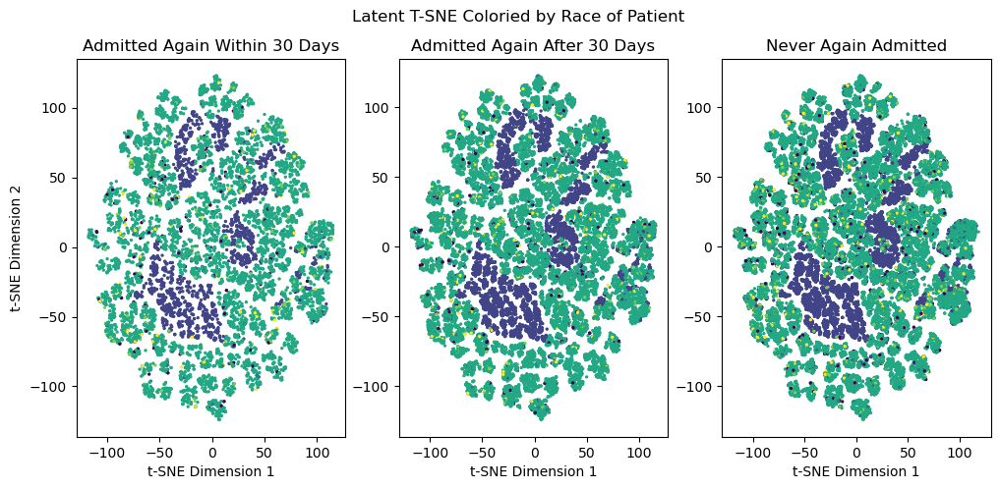
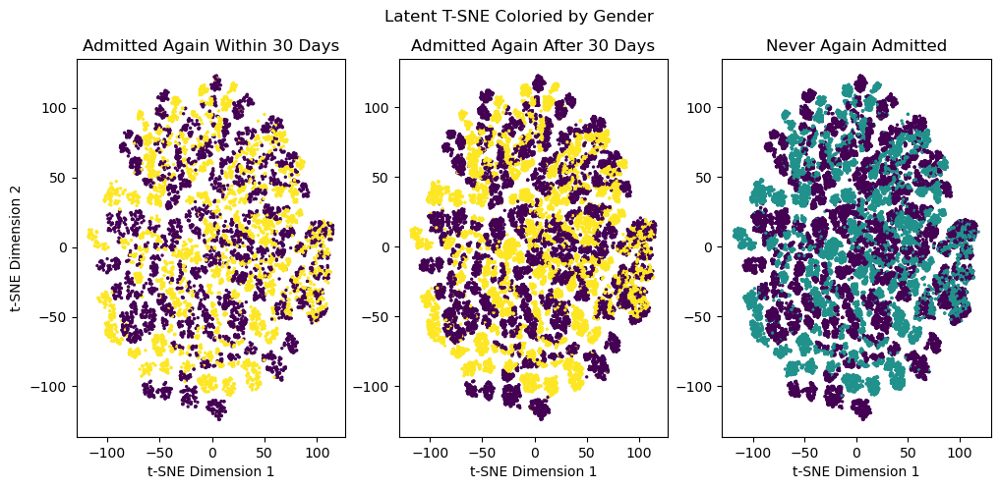
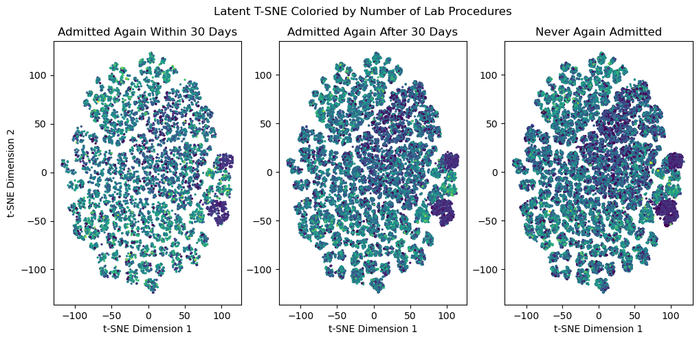
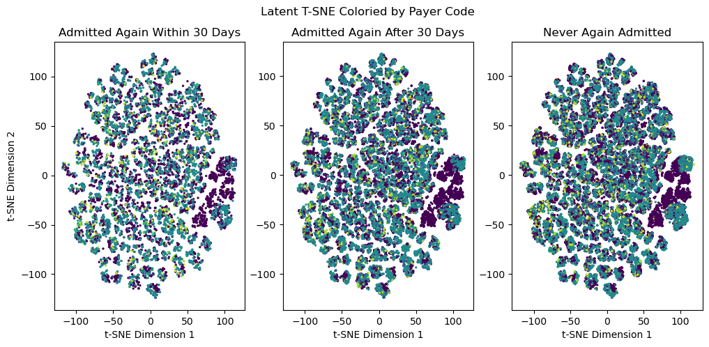

# Diabetes Readmission Prediction

This repository contains all my work for my BMI 6015 Applied Machine Learning Final Project.

# Motivation & Problem Statement

Hospital readmissions are a costly and frequent issues in healthcare, particularly for diabetic patients who have complex management needs (i.e. dosing themselves with insulin, and taking their own blood sugar many times per day) and associated complications (diabetics are frequently diagnosed with heart problems, and even vision problems), making them prone to repeat hospitalizations. Predicting readmission risk for diabetic patients is critical for healthcare providers to reduce readmission rates.

# Prior Work & Dataset

Strack et. al. has been instrumental in curating a database of diabetic patient visits. This database comes from 130 U.S. hospitals, and spans more than 100,000 patient visits, recording 50 attributes including demographics, diagneses, medications, lab procedures, payment codes, and more. This data is labelled according to whether the same patient showed up again within 30 days, after 30 days, or if they never showed up again. The authors of this dataset have already done their own analysis, showing corellations between various attributes and their labels. 

The data is hosted at [the UCI ML repository](https://archive.ics.uci.edu/dataset/296/diabetes+130-us+hospitals+for+years+1999-2008).

# Data Managment & Processing

To provide an explainable and reproducible view of our data, we show all preprocessing steps, from download, in the nodebook "data/DownloadData.ipynb". We then create the saved partitions of this data using the nodebook "data/PatitionData.ipynb", and only use these saved test/train/validation partitions for the entire project. Additional notebooks pertaining to the data are also avaliable in "data/". Partitions are divided by patient id, as to avoid leakage of non-independent samples from the same patient across the partitions. Our data loading process is documented in the file "data/loader.py", which can be imported from any python file. Importing this file and calling the `encode_and_partition` function reveals the data, split up by partitions informed by the partition files, in pytorch and numpy formates, ready for model training. Additionally, before handing any data to model, we do one-hot-encoding to all attributes, as all attributes were best encoded in categorical formats. This resulted in turning the remaining attributes into a 2831-dimensional vector. We do further preprocessing in "data/loader.py", such as removing low-entropy attributes and seperating labels from featres. Any file that imports "data/loader.py" will automatically load all data as a pandas dataframe, and can then do further preprocessing on thid dataframe before calling the `encode_and_partition` function (such as dropping specific attributes for an ablation study).

The resutling data was imbalanced according to the three label classes (readmitted in <30 days, >30 days, or never readmitted) in the corresponding proportins:
| Label                     | Precentage of Training Data with label |
| -----                     | -------------------------------------- |
| never readmitted          | 54% |
| readmitted after >30 days | 35% |
| readmitted in <30 days    | 11% |

# ML Models

Classifier model metrics for prediction "never readmitted":

| Model             | AUC ROC | AUC PR |
| -----             | ------- | ------ |
| SVM               | 0.62    | 0.66   |
| Linear Regression | 0.68    | 0.70   |
| RBM Network       | 0.71    | 0.73   |

## Autoencoder

The motivation for training an autoencoder on this data is to not only compress the 2831-dimensional one-hot-encoded input space into a lower-dimensional space (improves speed of applying PCA and T-SNE), but to also create a space which is better-suited for applying PCA and T-SNE by leveraging the non-linear transformation of the autoencoder encoder. Autoencoder are also lossy compressor, but tend to denoise, so are not a terrible way to encode data. I trained several autoencoders, and found that autoencoder with lowest-dimensional latent space (n=16, rather than n=64) had best clustering in PCA & T-SNE. This is the autoencoder I refer to. This autoencoder had a total of 4 layers (2 encoder, 2 decoder). With an input space of of size 2831, and latent space of size 16. This autoencodeer techincally had a compression ratio of 16/2831 --> 00.56%. However, considering the fact that the 2831-dimensional input space is derived from a <50-attribute space, this is not truly the compression ratio, but is still a decent compression on the input data. This revealed that the data was highly compressible. Next, I visualized the compressed latent space in my latent PCA, and latent T-SNE notebooks in the folder "models/ae". Autoencoder models are saved, and tracked with the wandb package.

## PCA on AE latent representations

The motivation for applying PCA to the autoencoder latent space it to see if any clusters appear, and if these clusters are of specific label groups.

Colors represent different label classes. PCA of the latent space revealed no stratification or clustering.

## T-SNE on AE latent representations

The motivation for applying T-SNE, after applying PCA to the same latent space, is many fold: T-SNE is better at visualizing complex manifolds than PCA as it is non-linear and tries to preserve the distances of data points more. As a result, T-SNE is more likley to display clusters than PCA.

After applying T-SNE to every latent representation of every datapoint in my training set, I visualized this space by seperating the points into three plots in a triptic fasion, as seen below. The left most plot is for patients who were readmitted within 30 days. The middle plot is for patients readmitted after 30 days, and the rightmost plot is for patients who were never readmitted. Colors represent different attributes in each plot.

The story these plots tell is three fold; patients in this space are heavily clustered primarily by gender, and also by race, while different types of diabetics showing up in the number of lab prodedures, and the presense of the max glu serum test (a test only given to those with diabetes, or pregnant women to monitor their glucose levels). Interestingly, there is a striking corellation between the type of insurance someone has, the number of lab tests they have done, and the max glucose serum test.

## SVM

## Linear Regression

## RBFNN

## Bonus Model: Latent Linear Regression

## Improvements

// VAE instaed of AE
// Optuna
// data is skewed by patients who died: if you die you cannot be readmitted

# Environment Managment